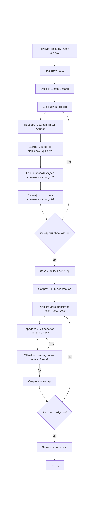

### I. Определение алгоритма обезличивания

Данные обезличены тремя способами:

1. **Телефон** - SHA-1 хеш. Определяется по длине (40 hex-символов) и формату. Односторонняя функция, но для российских мобильных номеров (10^9 вариантов) восстановление возможно полным перебором.

2. **Адрес** - шифр Цезаря по русскому алфавиту (32 буквы). Определяется по структуре: цифры, точки, пробелы и сокращения ("д.", "кв.") остаются на месте, сдвинуты только буквы. Перебор 32 вариантов сдвига дает осмысленный текст ровно при одном значении.

3. **Email** - шифр Цезаря по латинскому алфавиту (26 букв). Определяется аналогично: структура адреса (@, точки, цифры) сохранена, сдвинуты только буквы. Ключ (сдвиг) совпадает с ключом адреса в той же строке.

### II. Алгоритм деобезличивания

Программа работает в две фазы.

**Фаза 1 - расшифровка адресов и email (шифр Цезаря):**

1. Прочитать строку CSV, разделить на поля: Телефон, email, Адрес.
2. Для поля Адрес перебрать все сдвиги от 0 до 31.
3. Для каждого сдвига расшифровать адрес и подсчитать вхождения маркеров ("д.", "кв.", "ул.", "пл.", "пер.", "наб." и др.).
4. Выбрать сдвиг с максимальным количеством совпадений - это ключ шифрования.
5. Расшифровать адрес: сдвинуть каждую русскую букву назад на найденный ключ по модулю 32.
6. Расшифровать email тем же ключом: сдвинуть каждую латинскую букву назад по модулю 26.

**Фаза 2 - восстановление телефонов (SHA-1 перебор):**

1. Собрать все хеши телефонов из входного файла.
2. Для каждого формата номера (8XXXXXXXXXX, +7XXXXXXXXXX, 7XXXXXXXXXX) перебрать коды операторов 900-999 и 10^7 номеров на каждый код.
3. Для каждого кандидата вычислить SHA-1 и сравнить с целевыми хешами.
4. Перебор распараллелен через multiprocessing.Pool, коды операторов распределены по воркерам.

### Блок-схема алгоритма

### III-V. Программная реализация

Код: `task3.py`. Зависимостей нет, только стандартная библиотека Python (csv, hashlib, sys, time, dataclasses, multiprocessing).

Запуск: `python task3.py in.csv out.csv`

Результат: CSV с исходными полями + четыре новых столбца (сдвиг, Телефон_расшифровка, Адрес_расшифровка, email_расшифровка).
